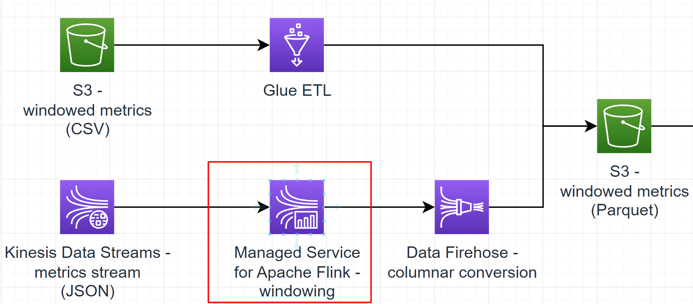

# Sub-task 5 - analysing with AWS Managed Service for Apache Flink

**NOTE**: AWS Managed Service for Apache Flink is mostly similar in functionality to its predecessor called AWS Kinesis Data Analytics. Both services are
based on Apache Flink.

# Goal
* write an Apache Flink application for computing windows on metrics events
* deploy the Apache Flink application to Kinesis Data Analytics
* connect the Apache Flink application to a Kinesis stream

# Instructions option A - Java API

## Step 1 - create a streaming application
* create an Apache Flink application that
    * reads events from a stream of events that correspond to the _Metrics stream_ model
    * applies [tumbling windows](https://nightlies.apache.org/flink/flink-docs-release-1.14/docs/dev/datastream/operators/windows/#tumbling-windows) to the stream - 5 minutes per window based on the event publication timestamp
    * reduces each window into an aggregate event that corresponds to the _Windowed metrics_ model
    * prints the resulting aggregate windows to `stdout`
* **implementation recommendations**
  * make sure to configure a **timestamp assigner**
  * make sure to configure a proper **watermark strategy with source idleness timeout**
  * follow the [Flink test template](https://git.epam.com/epm-cdp/global-java-foundation-program/java-courses/-/tree/main/data-training-for-devs/courses/Data_Training_for_Java_developers/aws/materials/flink-test-template)
    * this template project will help you to set up a baseline for the dependencies required to package a Flink application for AWS deployment using an Uber (shaded) JAR
    * also it contains an example of how to handle serialisation and JSON mapping with Flink - **this is one of the main specifics of Flink API**
    * also, it contains a convenient template for running Flink integration tests locally against LocalStack's Kinesis implementation
    * in case you're more inclined towards Maven, you may still reuse the integration test template and look up a POM example [here](https://github.com/aws-samples/amazon-managed-service-for-apache-flink-examples/blob/main/java/KinesisConnectors/pom.xml)

## Step 2 - test the streaming application
* write some [unit tests](https://nightlies.apache.org/flink/flink-docs-release-1.14/docs/dev/datastream/testing/) for the application

## Step 3 - deploy the streaming application
* deploy the application to Kinesis Data Analytics
    * extend the CloudFormation template created in sub-task 4
    * update your code to work with [Kinesis Data Streams as a source](https://docs.aws.amazon.com/managed-flink/latest/java/how-sinks.html#input-streams)
    * [create a Data Analytics application](https://docs.aws.amazon.com/managed-flink/latest/java/how-creating-apps.html) based on your code
    * connect the application to the stream created in sub-task 4
    * **PITFALL**: Pay attention to the fact that your application must be [correctly deployed in a VPC private subnet](https://docs.aws.amazon.com/managed-flink/latest/java/vpc-internet.html) to get access to other AWS resources
    * **PITFALL**: Make sure you build your Flink application JAR against the same Flink version as the one used in Data Analytics
* run your application and make sure the application logs contain aggregate metrics

# Cost management recommendations
* make sure to dispose the resources create using CloudFormation - **Kinesis Stream is the most expensive component in the overall solution**
* if you use an interactive notebook, make sure to use parallelism 1 for it and also dispose it once you've done experimenting/testing
